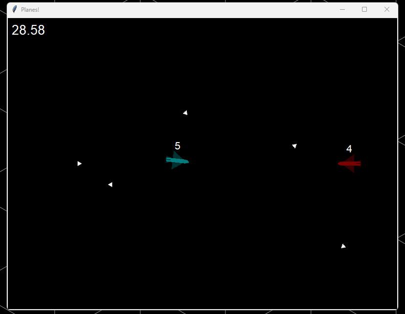

# 2D Plane AI Competition

The Swinburne Programming Club has discovered an entry point to the 2D realm and can foresee a variety of ways in which it can be exploited for significant profit.

However, a lot of other organisations have also discovered this realm, and thus a war for control over the realm has emerged.

The SPC has designed an unmanned 2D combat aircraft to assert its dominance over the realm. Your job is to compete with your fellow members to develop the best code for the combat plane, which will fight in a simulation with an identical plane with its own AI.
## Great! But how?
To get started, first make sure you have Python installed, then clone this repository and run `pip install -r requirements.txt` within the repository folder to install the required dependencies.

Start by running `python main.py`. Two planes will fly across the screen firing small bullets.

`plane1_ai.py` contains the code for the blue plane. This is where your code goes. Your task is to edit this file to make the plane smarter.

`plane2_ai.py` contains the code for the enemy plane. Plane 2 behaves as an exact mirror image of Plane 1. This means you can copy someone else's `plane1_ai.py` into your `plane2_ai.py` and verse them in a 100% fair match. In fact, if you swap the two planes' AIs around, you are guaranteed to get a perfect mirror image of the same battle, and if both Plane 1 and Plane 2 have the same AI then they're guaranteed to draw.

Once you've developed your AI, share it on the [SPC Discord server](https://discord.com/invite/As9fscu6gV) to see if it can beat anyone else's. At the end of the challenge we'll also host a round robin tournament in a Discord voice channel to determine the ultimate victor.

In the `examples` folder, `zain_ai.py`, `samson_ai.py` and `ash_ai.py` are example AIs that you can copy into `plane2_ai.py` to fight against your plane. Feel free to take inspiration from our code.

More information about how to write the code can be found in `plane1_ai.py`.
## Rules
- Your code must be purely deterministic. This means it must not receive any external inputs while it is running (except for debugging and testing). This also means **you are not allowed to generate hardware random numbers within your code**, since hardware random numbers (e.g. random numbers produced by Python's built-in `random` library) always depend on external inputs
- Your code also must not depend on any external libraries, excluding NumPy
- Try not to vibecode

Good luck!